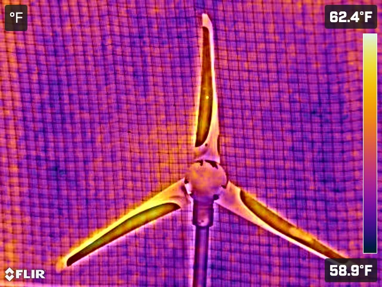

# Thermal Dataset 1: Wind Turbine Blade Inspection

## Overview

In the Machine Learning and Drone Lab at Utah Valley University, we have developed a comprehensive thermal image dataset specifically designed for Wind Turbine Blade (WTB) inspection. This dataset, consisting of 1000 thermal images, is an invaluable resource for advancing research in this field.

## Dataset Composition

### Image Collection

The dataset comprises 1000 thermal images, each uniformly processed to ensure consistency and clarity. Key processing steps included:

- **Cropping**: Adjusting each image to focus on relevant sections.
- **Centering and Resizing**: Standardizing all images to a resolution of 320x320 pixels.
- **Classification**: Labeling images as either *healthy* or *faulty*, aiding in the inspection process.

### Dataset Breakdown

To ensure a balanced perspective, the dataset is divided equally, containing:

- 500 images of **Healthy WTB Blades**.
- 500 images of **Faulty WTB Blades**, featuring various defects like cracks, erosion, and holes.

*Here is an example of MSX visualization of the WTBs.*

## MSX Technology

A pivotal element of our dataset creation is the use of the FLIR C5 Compact Thermal Camera, equipped with Multi-Spectral Dynamic Imaging (MSX) technology. This technology enhances our thermal imaging by integrating thermal data with standard RGB imagery, leading to more detailed and insightful images. The MSX technology is crucial for accurately identifying and analyzing faults in WTBs.

## Applications and Research

This dataset is particularly geared towards:

- **Enhancing WTB Inspection Techniques**: Providing a rich resource for developing more accurate and efficient inspection methods.
- **Machine Learning and AI Research**: Offering a diverse range of images for training and testing algorithms focused on fault detection and classification.

## Conclusion

Our Thermal Dataset 1 represents a significant step forward in the field of WTB inspection. With the integration of advanced imaging technologies like MSX, we aim to propel research and development in this crucial area, contributing to the sustainability and efficiency of wind energy.

---

*For more information or to access the dataset, please contact the Machine Learning and Drone Lab at Utah Valley University.*
